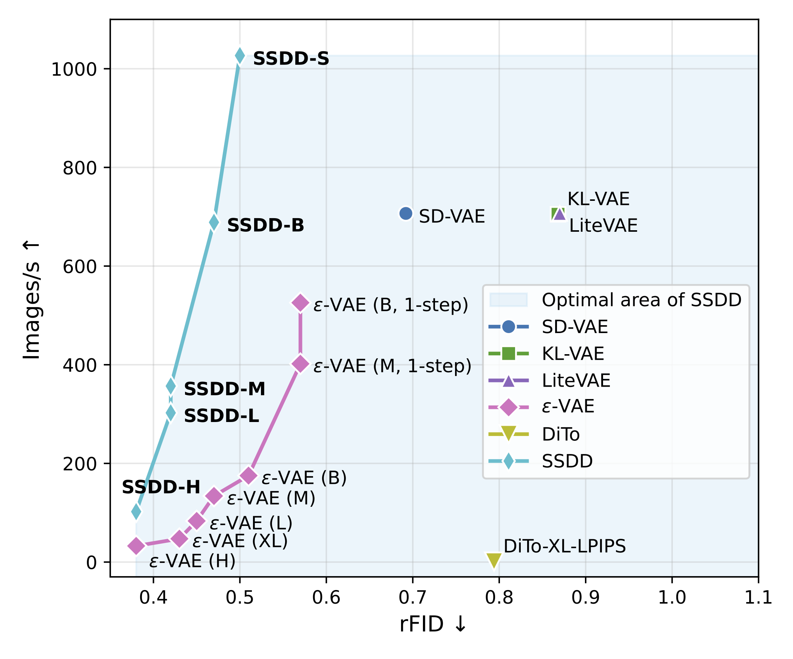

# SSDD: Single-Step Diffusion Decoder for Efficient Image Tokenization

Official implementation for [SSDD: Single-Step Diffusion Decoder for Efficient Image Tokenization](https://arxiv.org/abs/2510.04961)
<br/>
[Théophane Vallaeys](https://webalorn.com/), [Jakob Verbeek](https://lear.inrialpes.fr/people/verbeek/), [Matthieu Cord](https://cord.isir.upmc.fr/)

## Introduction


SSDD is a single-step diffusion decoder with applications to image generation.
It replaces the usual decoder of auto-encoders such as used by latent diffusion models with a GAN-free model training using flow-matching.
It achieves superior performances compared to existing models, with higher speed and reconstruction quality.

**Abstract:**

> Tokenizers are a key component of state-of-the-art generative image models, extracting the most important features from the signal while reducing data dimension and redundancy. Most current tokenizers are based on KL-regularized variational autoencoders (KL-VAE), trained with reconstruction, perceptual and adversarial losses. Diffusion decoders have been proposed as a more principled alternative to model the distribution over images conditioned on the latent. However, matching the performance of KL-VAE still requires adversarial losses, as well as a higher decoding time due toiterative sampling. To address these limitations, we introduce a newpixel diffusion decoder architecture for improved scaling and training stability, benefiting from transformer components and GAN-free training. Weuse distillation to replicate the performance of the diffusion decoder in an efficient single-step decoder. This makes SSDD the first diffusion decoder optimized for single-step reconstruction trained without adversarial losses,reaching higher reconstruction quality and faster samplingthan KL-VAE. In particular, SSDD improves reconstruction FID from 0.87 to 0.50 with 1.4⨉ higher throughput and preserve generation quality of DiTs with 3.8⨉ faster sampling. As such, SSDD can be used as a drop-in replacement for KL-VAE, and for building higher-quality and faster generative models.

<p float="center" align="center">
    
    <br><strong><em>Our method outperforms all existing decoders, improving both speed and quality</strong></em>
</p>

<p float="center" align="center">
     
    <br><strong><em>Qualitative samples from a standard Auto-Encoder (KL-VAE),<br>and our non-distilled and distilled models (SSDD-M).</strong></em>
</p>


## Citation

If you find our models and paper helpful, please consider citing our work:
```
@article{vallaeys2025ssdd,
    title={SSDD: Single-Step Diffusion Decoder for Efficient Image Tokenization}, 
    author={Théophane Vallaeys and Jakob Verbeek and Matthieu Cord},
    year={2025},
    volume={2510.04961},
    journal={arXiv},
    url={https://arxiv.org/abs/2510.04961},
}
```


## Setup


Those steps shows how to install SSDD to be imported and used inside another project, with minimal dependencies.

### Requirements

You need a python environment with `torch` and `torchvision` installed.
If you do not have, you can start by creating a conda environment:

```bash
conda env create -f environment.yml
conda activate ssdd
```

### Installing the project

To get started, clone the repository, and install the project and its dependencies inside the environment: 

```bash
# Clone from github
git clone https://github.com/facebookresearch/SSDD

# Chose one of the following:
# Install only minimal dependencies to use SSDD as an import-only library
pip install -e .
# Additional notebook-related dependencies to run the `demo.ipynb` notebook
pip install -e ".[demo]"
# Full dependencies to run training & eval scripts below
pip install -e ".[dev]"
```


If you want to directly use `ssdd` models inside another project, you can also install it directly from github:

```bash
pip install git+https://github.com/facebookresearch/SSDD
```

## Pre-trained models

> *Weights of model from the paper coming soon...*

Decoder at different encoding scales will be released.
For now, the `demo_f8c4_M_128` model is available below.
You can download the weights of all models using `git clone https://huggingface.co/facebook/SSDD weights`, or manually download each model below into the `weights` directory.

| Model | Encoder | Decoder | Resolution | rFID | Notes |
|-|-|-|-|-|-|
| [demo_f8c4_M_128](https://huggingface.co/facebook/SSDD/resolve/main/demo_f8c4_M_128.safetensors?download=true) | f8c4 | M | 128x128 | - | Demo purposes only |

## Usage

### Running the demo

A demo is available inside [demo.ipynb](demo.ipynb), showcasing how to load a model and use it for encoding and decoding.
Running the notebook requires the additional `[demo]` dependencies.

### Importing SSDD into a project

Importing SSDD only requires the minimal dependencies.
It can be used as shown in [demo.ipynb](demo.ipynb):

```python
from ssdd import SSDD

# Load an existing model
model = SSDD(
    encoder="f8c4",
    decoder="M",
    checkpoint="weights/demo_f8c4_M_128.safetensors",
)

input_image = ... # Should be normalized into the [-1;1] interval
# Encode an image into a latent
z = model.encode(input_image).mode()
# Reconstruct image form the latent variable
reconstructed = model.decode(z, steps=8)
```


## Running training and evaluation scripts

Training and evaluatiog models requires the full `[dev]` dependencies.
You should have a local version of the [ImageNet](https://www.image-net.org/) dataset inside the `imagenet_data` directory, with `train` and `val` subdirectories.
You can overload the location of ImageNet by either setting the `dataset.imagenet_root=<path>` parameter, or setting it directly in `main.yaml`.
When training models with different configurations, change the `run_name=` accordingly. 

### Training models


Training an encoder together with a M decoder
```bash
accelerate launch ssdd/main.py run_name=train_enc_f8c4 \
    dataset.im_size=128 dataset.aug_scale=2 training.lr=1e-4 ssdd.encoder_train=true
```


Stage 1 training: shared pre-training of a model at resolution $128\times 128$ with data augmentation
```bash
accelerate launch ssdd/main.py run_name=f8c4_M_pretrain \
    dataset.im_size=128 dataset.aug_scale=2 ssdd.encoder_checkpoint=train_enc_f8c4
```


Stage 2: Finetune model at $128x128$
```bash
accelerate launch ssdd/main.py run_name=f8c4_M_128 \
    training.epochs=200 dataset.im_size=128 training.lr=1e-4 ssdd.checkpoint=f8c4_M_pretrain
```

Stage 2: Finetune model at $256x256$
```bash
accelerate launch ssdd/main.py run_name=f8c4_M_256 \
    training.epochs=200 dataset.im_size=256 training.lr=1e-4 ssdd.checkpoint=f8c4_M_pretrain
```

Distillation of a model into a single-step decoder
```bash
accelerate launch ssdd/main.py run_name=f8c4_M_128_distill \
    training.epochs=10 training.eval_freq=1 dataset.im_size=128 training.lr=1e-4 \
    ssdd.checkpoint=f8c4_M_128 ssdd.fm_sampler.steps=7 distill_teacher=true
```

### Evaluating models

Evaluation of multi-steps model
```bash
accelerate launch ssdd/main.py task=eval dataset.im_size=128 ssdd.checkpoint=f8c4_M_128 ssdd.fm_sampler.steps=8
```

Evaluation of a singl-step model (distilled)
```bash
accelerate launch ssdd/main.py task=eval dataset.im_size=128 ssdd.checkpoint=f8c4_M_128_distill ssdd.fm_sampler.steps=1
```

Computing the mean / variance of the encoded features.
This is used for normalizing features to be used for latent diffusion.
Please note we use a single process (`--num_processes 1`), disable model compilation `ssdd.compile=false`, and only need to load the encoder weights (`ssdd.encoder_checkpoint=<...>`).
```bash
accelerate launch --num_processes 1 ssdd/main.py task=z_stats ssdd.compile=false ssdd.encoder_checkpoint=train_enc_f8c4
```

### Parameters reference

Main arguments:
- `run_name`: a unique name to run training or evaluation tasks. By default, checkpoints will be stored inside `runs/jobs/<run_name>`. Setting `run_name` allows resuming from training state. If not set, defaults to date-time.
- `task=train` / `task=eval`: selects the task to run. *Default: `train`.*
- `dataset.im_size=<128/256/512>`: sets the image size used for training and evaluation.
- `ssdd.encoder=f<?>c<?>`: sets the encoder resolution. The `f` value is the patch resolution, the `c` value is the latent channel dimension. *Default: `f8c4`.*
- `ssdd.decoder=<S/B/M/L/XL/H>`: sets the decoder size. *Defaults: `M`.*
- `ssdd.checkpoint=<...>`: loads the model weights from a pre-trained checkpoint. Can be either the name of a previous run (set by `run_name`), or an absolute path.
- `ssdd.fm_sampler.steps=<...>`: number of steps for sampling, used both for evaluation tasks and evaluation during training. Should be set to `1` to evaluate single-step models. *Default: `8`.*
    - During distillation process, this is the number of steps for the *teacher* model.

Training arguments:
- `dataset.batch_size=<...>`: sets the total batch size, which is split between GPUs. *Default: `156`.*
- `dataset.aug_scale=2`: enables the random scaling data augmentation for training
- `training.epochs=<...>`: total number of training epochs. *Default: `300`.*
- `training.lr=<...>`: training learning rate.
- `ssdd.encoder_train=true`: enables training the encoder.
- `ssdd.encoder_checkpoint=<...>`: loads a pre-trained frozen encoder. Can be either the name of a previous run (set by `run_name`), or an absolute path.
- `distill_teacher=true`: copy the model loaded by `ssdd.checkpoint`, and use it as a multi-step teacher for single-step distillation.
- `+blocks=gan`: adds a GAN loss by training a discriminator alongside the decoder.

Misc arguments:
- `dataset.limit=<...>`: will use only a part of the training and evaluation datasets. Useful for debug (`dataset.limit=32`) or evaluation on Imagenet-5K (`dataset.limit=5_000`).
- `dataset.batch_size=<...>`: sets the batch size.
- `training.log_freq=<...>`: logs frequency during training iterations. Useful for debug (`training.log_freq=1`). *Default: `200`.*
- `training.eval_freq=<...>`: frequency of metrics evaluation during training. Useful for debug (`training.eval_freq=1`). *Default: `4`.*
- `ssdd.compile=false`: disables model compilation, can use used to train on GPUs that do not support `torch.compile`
- `dataset.imagenet_root=<...>`: sets the location of the ImageNet dataset


## Legal
SSDD is licenced under CC-BY-NC, please refer to the LICENSE file in the top level directory.

Copyright © Meta Platforms, Inc. See the Terms of Use and Privacy Policy for this project.